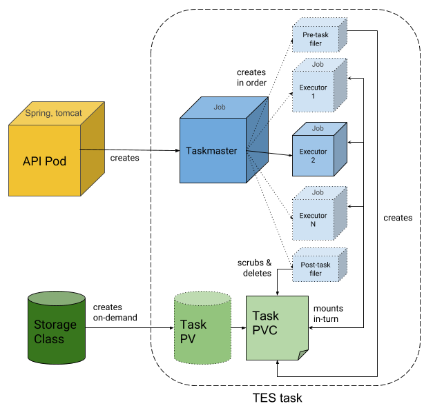

An implementation of a task execution engine based on the [TES standard](https://github.com/ga4gh/task-execution-schemas) running on `Kubernetes`. For more details on `TES`, see the (very) brief [introduction to TES](documentation/tesintro.md).

For organisational reasons, this project is split into 2 repositories: One containing the API and associated docker images ([here](https://github.com/EMBL-EBI-TSI/tesk-api)) and one containing the actual task execution service and associated `Docker` images (this one). If the API is running on your cluster it will pull the images from our `gcr.io` repository automatically.

`TESK` is designed with the goal to support any `Kubernets` cluster, for its deployment please refer to the [deployment](documentation/deployment.md) page, the instructions provided there can be used in heterogeneous environments, with minimal configuration.

We are also providing some specific instructions for setting up and exposing the `TESK` service using:

-   RedHat [OpenShift](documentation/openshift_setup.md)
-   On-Premises VMs in [OpenStack](documentation/ingress.md)

The technical documentation is available in the [documentation](documentation) folder.

## Architecture
As a diagram:

**Description**: The main work is performed by 2 pods. First is the API pod, a pod which runs a web server (`NGINX`) and exposes the `TES` specified endpoints. It consumes `TES` requests, validates them and translates them to `Kubernetes` jobs. The API pod then creates a `task controller` pod, or `taskmaster`. The `taskmaster` consumes the executor jobs, inputs and outputs. It creates `Persistent Volume Claims` to mount as scratch space, input / output file space and (optionally) additional mounts specified in the `TES` request. It then creates a `pre-task` job to populate `PVC`’s (downloading inputs). It then loops through the executor jobs, waiting for each one to complete before moving on to the next one.

## Requirements
-   A working [Kubernetes](https://kubernetes.io/) cluster version 1.8 and later.
