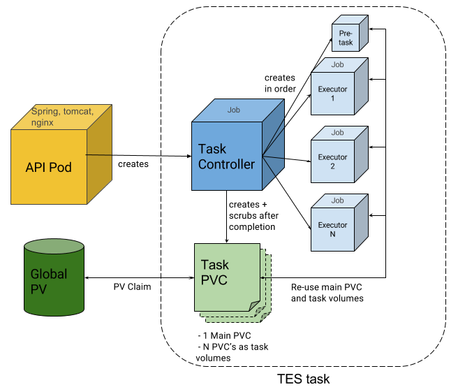

An implementation of a task execution engine based on the [TES standard](https://github.com/ga4gh/task-execution-schemas) running on Kubernetes. For more details on TES, see the [(very) brief introduction to TES](tesintro.md).

For organisational reasons, this project is split into 2 repositories: One containing the API and associated docker images ([here](https://github.com/EMBL-EBI-TSI/tesk-api)) and one containing the actual task execution service and associated Docker images (this one). If the API is running on your cluster it will pull the images from our gcr.io repository automatically. In that vein, see below under 'How to install' to get TESK up and running on your Kubernetes cluster.

## Requirements
-   A working Kubernetes cluster (e.g. [Minikube](https://github.com/kubernetes/minikube))

## How to install
-   Clone the repo to your kube-master and cd into the folder
-   Find out what is the external IP for the cluster. E.g. with the command `minikube ip`
-   Edit the following line in `specs/ingress/nginx-ingress-lb.yaml` with that IP:

```yaml
 spec:
  type: NodePort
  externalIPs:
-   127.0.0.1 <--- replace this with your cluster's external ip address

```

-   Create the services necessary to run the API:

```
kubectl create -f specs/ingress/
kubectl create -f specs/core/
```
-   This will expose the API service on a port in your cluster, run `kubectl get services` to see where.
-   Send an [example TESK request](https://github.com/EMBL-EBI-TSI/TESK/blob/master/specs/task_example.json), replacing `127.0.0.1:30977` with your services' ip and port:

```bash
curl -H "Content-Type: application/json" -d @specs/task_example.json http://127.0.0.1:30977/v1/tasks
```
-   Watch `kubectl get pods` to see the tasks appear and complete.

## Architecture
As a diagram:



Description: The main work is performed by 2 pods. First is the API pod, a pod which runs a web server (NGINX) and exposes the TES specified endpoints. It consumes TES requests, validates them and translates them to Kubernetes jobs. The API pod then creates a task controller pod, or Taskmaster. The taskmaster consumes the executor jobs, inputs and outputs. It creates Persistent Volume Claims to mount as scratch space, input / output file space and (optionally) additional mounts specified in the TES request.It then creates a pre-task job to populate PVC’s (downloading inputs). It then loops through the executor jobs, waiting for each one to complete before moving on to the next one.
